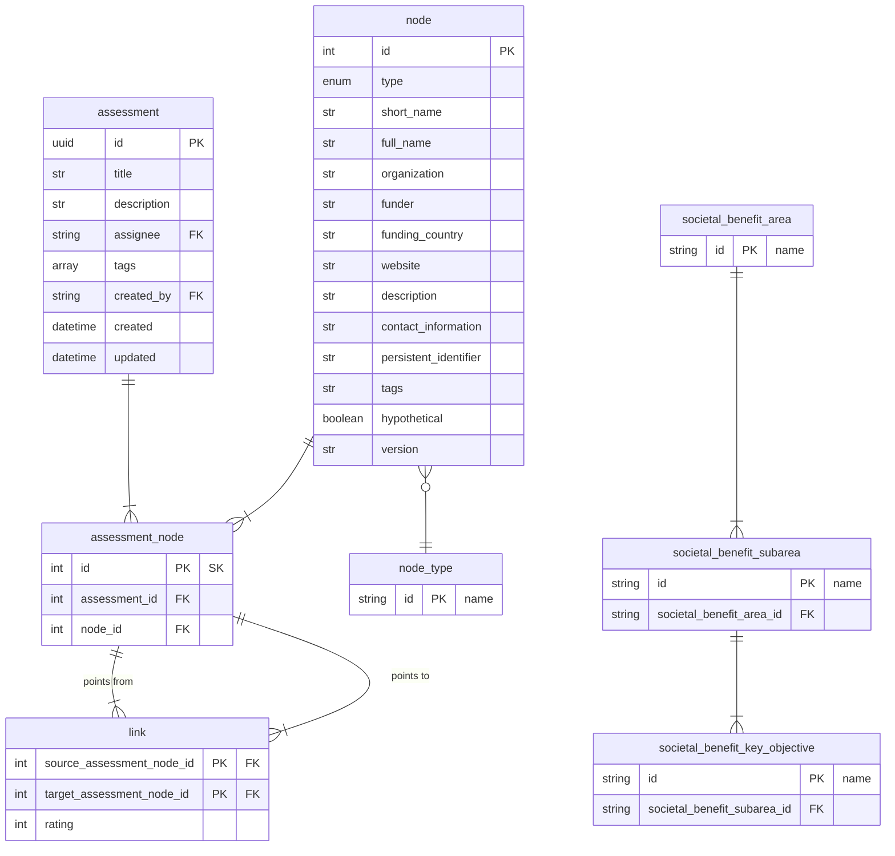

## NOTES:
- we started imagining a model with the different node types unified within one main table
- relationships are now `links` also in a unified table
- starting to think more about `node` table as a library of node objects (data products, applications, etc)
- TODO: how do we handle societal benefit areas, other node types are more uniform. Should we represent each of the 12 major SBAs as nodes in the node library with special fields that link those nodes to sba sub areas (or another way).
- NOTE: some needed tables were deleted to make this process easier visually in mermaid (should we add them back?)
- NOTE: Survey became Assessment

