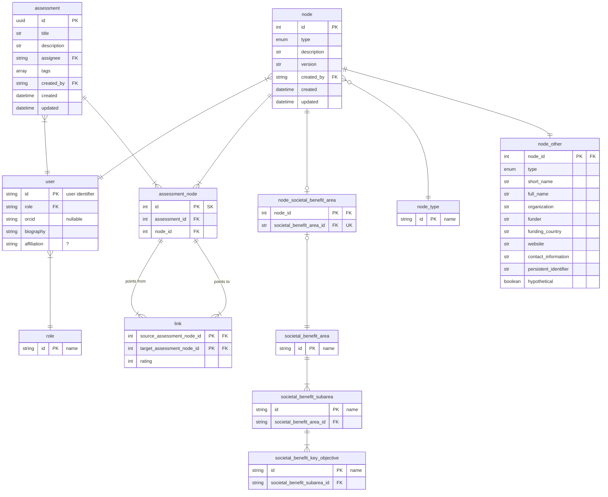

```mermaid
erDiagram

user {
    string id PK "user identifier"
    string role FK
    string orcid "nullable"
    string biography
    string affiliation "?"
}

role {
    string id PK "name"
}

%% Dynamic operational data:
assessment {
    uuid id PK
    %% seq version PK

    str title
    str description

    string assignee FK

    array tags

    string created_by FK
    datetime created
    datetime updated
}


assessment_node {
    int id PK "SK"
    int assessment_id FK
    int node_id FK

}

link {
    int source_assessment_node_id PK "FK"
    int target_assessment_node_id PK "FK"

    %% TODO identify which rating
    int rating
}

%% AKA node library
node {
    int id PK

    enum type

    str description
    %% not implemented in the app
    %% str tags
    str version

    string created_by FK
    datetime created
    datetime updated

}

node_other{
    int node_id PK "FK"
    %% str societal_benefit_area_id FK "UK"

    enum type
    str short_name
    str full_name
    str organization
    str funder
    str funding_country
    str website
    str contact_information
    str persistent_identifier
    boolean hypothetical
}

node_societal_benefit_area {
    int node_id PK "FK"
    str societal_benefit_area_id FK "UK"
}


%% Static reference data:
node_type {
    string id PK "name"
}
societal_benefit_area {
    string id PK "name"
}
societal_benefit_subarea {
    string id PK "name"
    string societal_benefit_area_id FK
}
societal_benefit_key_objective {
    string id PK "name"
    string societal_benefit_subarea_id FK
}


%% Relationships

assessment }|--|| user: ""
user }|--|| role: ""
node }|--|| user: ""


assessment_node ||--|{ link: "points from"
assessment_node ||--|{ link: "points to"

node ||--|{ assessment_node: ""
assessment ||--|{ assessment_node: ""

node ||--o| node_societal_benefit_area: ""
node_societal_benefit_area |o--|| societal_benefit_area: ""


node }o--|| node_type: ""
node ||--|| node_other: ""


societal_benefit_area ||--|{ societal_benefit_subarea: ""
societal_benefit_subarea ||--|{ societal_benefit_key_objective: ""
```
